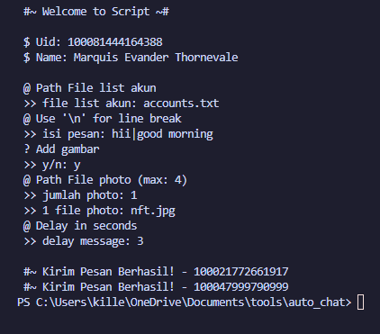

<h1 align="center">facebook-chat-automation</h1>

This Python script provides a simple yet powerful automation tool for interacting with Facebook Messenger.

<h2>Features:</h2>
<ol>
  <li><strong>Web Scraping:</strong> Utilizes web scraping techniques with libraries such as <code>requests</code>, <code>BeautifulSoup</code>, and <code>re</code> to interact with the Facebook Messenger web interface.</li>
  <li><strong>Cookie-based Authentication:</strong> Allows users to log in using their Facebook cookies for authentication.</li>
  <li><strong>Sending Messages:</strong> Enables sending messages to specified Facebook users or groups. Users can input a message and choose accounts from a list to send messages to.</li>
  <li><strong>Sending Photos:</strong> Supports sending photos along with messages. Users can provide paths to photo files, and the script handles the upload and inclusion of photos in messages.</li>
  <li><strong>Delay Functionality:</strong> Provides an option to set a delay between sending messages, allowing for controlled and gradual message sending.</li>
  <li><strong>Exception Handling:</strong> Implements exception handling for cases such as invalid cookies or missing files.</li>
  <li><strong>Clear CLI Interface:</strong> Offers a clear command-line interface for user interaction and feedback.</li>
</ol>

<h2>How to Install?</h2>
<h3>Clone Repo</h3>
<pre>
git clone https://github.com/Latip176/comment-bot-group-facebook
</pre>
<h3>Install Requirements</h3>
<pre>
python3 -m pip install -r requirements.txt
</pre>

This feature-rich script is suitable for users looking to automate communication tasks on Facebook Messenger, whether for personal use or business purposes. With its simplicity and versatility, it provides a convenient solution for managing messaging workflows.

